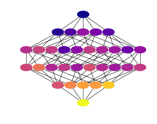
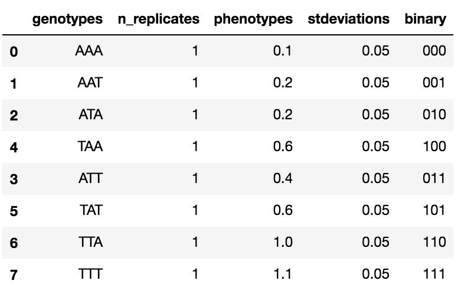

# GPMap

[](https://gitter.im/harmslab/gpmap?utm_source=badge&utm_medium=badge&utm_campaign=pr-badge&utm_content=badge)
[](http://gpmap.readthedocs.io/en/latest/?badge=latest)

*A Python API for managing genotype-phenotype map data*

GPMap defines a flexible object for managing genotype-phenotype (GP) map data. At it's core,
it stores all data in Pandas DataFrames and thus, interacts seamlessly with the
PyData egosystem.

To visualize genotype-phenotype objects created by GPMap, checkout [GPGraph](https://github.com/Zsailer/gpgraph).

 

## Basic example

Import the package's base object.
```python
from gpmap import GenotypePhenotypeMap
```

Pass your data to the object.
```python

# Data
wildtype = "AAA"
genotypes = ["AAA", "AAT", "ATA", "TAA", "ATT", "TAT", "TTA", "TTT"]
phenotypes = [0.1, 0.2, 0.2, 0.6, 0.4, 0.6, 1.0, 1.1]
stdeviations = [0.05, 0.05, 0.05, 0.05, 0.05, 0.05, 0.05, 0.05]

# Initialize the object
gpm = GenotypePhenotypeMap(wildtype,
                           genotypes,
                           phenotypes,
                           stdeviations=stdeviations)

# Check out the data.
gpm.data
```


Or load a dataset from disk.
```python
gpm = GenotypePhenotypeMap.read_json("data.json")
```

## Installation

To install this package, clone from source and use pip.
```
git clone https://github.com/harmslab/gpmap
cd gpmap
pip install -e .
```

## Dependencies

The following modules are required. Also, the examples/tutorials are written in Jupyter notebooks and require IPython to be install.

* [Numpy](http://www.numpy.org/)
* [Pandas](https://pandas.pydata.org/)
