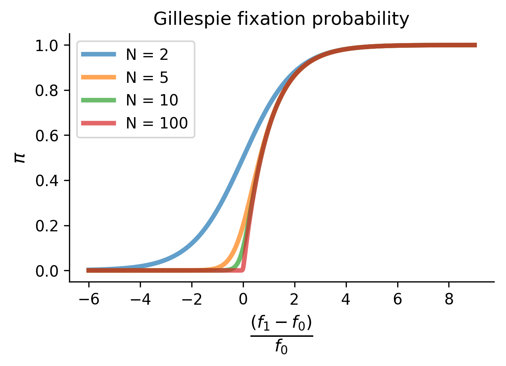

Evolution
=========

The ``evolution`` module handles

Evolving Methods
----------------

Simulating evolution on genotype-phenotype maps can be done in a couple ways.
This page provides examples and tutorials that make this easy to learn. The
following functions can be imported fro teh ``gpmap.evolve`` package. All methods
must be given a source and target.

Monte Carlo
~~~~~~~~~~~

The ``monte_carlo`` function will use Monte Carlo sampling to walk through a
genotype-phentoype map. Given a source and target, it will return all steps taken
to move between the source and target.

The algorithm builds a list of neighbors on-the-fly for each step. There is no `self` probability
considered when making a move, thus, this will NOT recapitulate stationary
frequencies, uncover a fitness landscape, or find equilibrium states. For the sake of
efficiency, it merely samples pathways from source to target. If you'd like
a better sampling of the fitness landscape and its equilibrium states, try
the monte_carlo_metropolis_criterion function.

**Example**

.. code-block:: python

    # Simulate evolution on a rough Mt. Fuji landscape
    from gpmap.simulate import MountFujiSimulation
    from gpmap.evolve import monte_carlo
    from gpmap.evolve.models import fixation

    # Simulate a genotype-phenotype map
    gpm = MountFujiSimulation.from_length(5)
    gpm.set_roughness((-1,1))

    # Monte carlo sample space
    source = "11111"
    target = "00000"
    path = monte_carlo(gpm, source, target, fixation, forward=False)

Monte Carlo, Metropolis Criterion
~~~~~~~~~~~~~~~~~~~~~~~~~~~~~~~~~

The ``monte_carlo_metropolis_criterion`` function will use Monte Carlo sampling
and a Metropolis criterion to walk through a genotype-phentoype map. Given a
source and target, it will return all steps taken to move between the source and
target.

This method chooses a sample at random from its neighbors and uses a Metropolis
criterion to accept or reject the move. The output will include all moves in the
simulation, including all 'self' moves. This is useful for sampling the fitness
landscape's stationary frequencies.

**Example**

.. code-block:: python

    # Simulate evolution on a rough Mt. Fuji landscape
    from gpmap.simulate import MountFujiSimulation
    from gpmap.evolve import monte_carlo
    from gpmap.evolve.models import fixation

    # Simulate a genotype-phenotype map
    gpm = MountFujiSimulation.from_length(5)
    gpm.set_roughness((-1,1))

    # Monte carlo sample space
    source = "11111"
    target = "00000"
    path = monte_carlo(gpm, source, target, fixation)

Evolutionary models
-------------------

GPMap comes with a few evolutionary models out of the box. They are live in the
``gpmap.evolve.models`` subpackage.

Gillespie Fixation
~~~~~~~~~~~~~~~~~~

The ``fixation`` function calculates a probability of fixing a new mutations given
the wildtype fitness and the new fitness using Gillespie's fixation model [1]_.

.. math::

    \pi_{i \rightarrow j} = \frac{1 - e^{-N \cdot \frac{f_j-f_i}{f_i}}}{1 - e^{-\frac{f_j-f_i}{f_i}}}

**Source Code:**

.. code-block:: python

    Ns = [2, 5, 10, 100, ]
    fig, ax = plt.subplots(figsize=(5,3))

    fitness1 = 1
    fitness2 = np.linspace(-5,10,1000)
    sij = (fitness2 - fitness1)/abs(fitness1)

    for N in Ns:
        # Check the value of denominator
        denominator = 1 - np.exp(-N * sij)
        numerator = 1 - np.exp(- sij)
        # Calculate the fixation probability
        fixation = numerator / denominator
        ax.plot(sij, fixation, linewidth=3, label="N = " + str(N), alpha=.7)

    ax.spines["right"].set_visible(False)
    ax.spines["top"].set_visible(False)
    ax.set_xlabel("$\\frac{(f_1 -f_0)}{f_0}$", fontsize=16)
    ax.set_ylabel("$\pi$", fontsize=12)
    ax.set_title("Gillespie fixation probability")
    ax.legend(loc=2)

References
----------
.. [1] Gillespie, John H. Population genetics: a concise guide. JHU Press, 2010.
