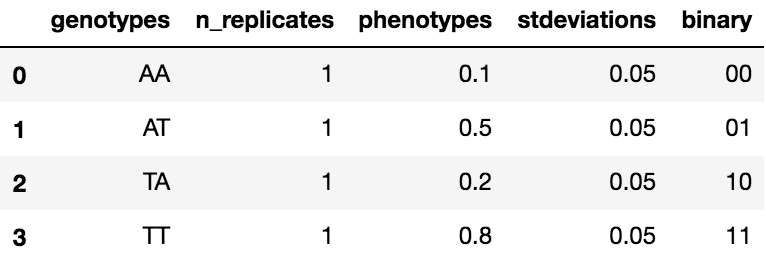

Quick start
===========

GPMap is a small Python package that subsets the pandas DataFrame to handle genotype-phenotype map data. The package include utilities to read/write data to/from disk, enumerate large sequence/genotype spaces efficiently, and
compute various statistics from an arbitrary genotype-phenotype map.

``GenotypePhenotypeMap`` object
-------------------------------

The main object in ``gpmap`` is the ``GenotypePhenotypeMap`` object. The object stores data as a Pandas DataFrame, which can be accessed through the ``.data`` attribute. Your object will look something like this:

.. code-block:: python

    from gpmap import GenotypePhenotypeMap

    # Data
    wildtype = "AAA"
    genotypes = ["AAA", "AAT", "ATA", "TAA", "ATT", "TAT", "TTA", "TTT"]
    phenotypes = [0.1, 0.2, 0.2, 0.6, 0.4, 0.6, 1.0, 1.1]
    stdeviations = [0.05, 0.05, 0.05, 0.05, 0.05, 0.05, 0.05, 0.05]
    mutations = {
      0: ["A", "T"],
      1: ["A", "T"],
      2: ["A", "T"]
    }

    # Initialize the object
    gpm = GenotypePhenotypeMap(
        wildtype,
        genotypes,
        phenotypes,
        mutations=mutations,
        stdeviations=stdeviations
    )

    # Check out the data.
    gpm.data

The underlying DataFrame will have at least 5 columns: *genotypes*, *phenotypes*, *stdeviations*, *n_replicates*, and *binary*. The *binary* column is computed by the ``GenotypePhenotypeMap`` object

``mutations`` dictionary
------------------------

The ``mutations`` dictionary tells GPMap what mutations, indels, etc. should be incorporated in the map. It is the most important data you pass to GPMap.

It is a regular Python dictionary and looks something like:

.. code-block:: python

  wildtype = "AA"
  mutations = {
      0: ["A", "B"],
      1: ["A", "B"]
  }

The key represents the position of site, and the value represents the states possible at each site. In this example, the sequences have two sites and each site is either "A" or "T".

**Non-changing sites**

If a site doesn't mutate, give it a value of ``None``.

.. code-block:: python

  wildtype = "AAA"
  mutations = {
      0: ["A", "T"],
      1: ["A", "T"],
      2: None           # This site does not change
  }

Here, site 2 does not change. All sequences will only have an "A" at that site.

**Indels**

You can incorporate indels using the *gap* character:

.. code-block:: python

  wildtype = "AAAA"
  mutations = {
      0: ["A", "T"],
      1: ["A", "T"],
      2: None,
      3: ["A", "-"]      # Sometimes, this site doesn't exist.
  }

Here, site 3 will toggle between an "A" and a missing residue "-" (deletion).

Port to NetworkX
----------------

In many cases, you might be interested in porting a ``GenotypePhenotypeMap`` to **NetworkX**. NetworkX provides powerful functions for analyzing and plotting complex graphs. We have written a separate package, named ``gpgraph``, to easily port ``GenotypePhenotypeMap`` to NetworkX.

.. code-block:: python

    
